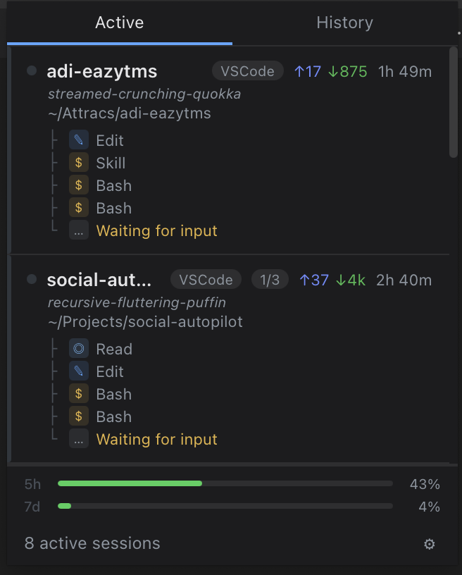

# Vigil

A macOS menubar app that monitors your active [Claude Code](https://claude.ai/code) sessions and lets you jump to them instantly.



## What it does

Vigil sits in your menubar and polls Claude Code's local data files every 3 seconds. Click the tray icon to see all running sessions — their status, current task, token usage, and which editor or terminal they're in. Click a session to bring that window to front.

**Session statuses:**
- 🟢 **Active** — Claude is currently executing tools
- 🟡 **Waiting** — waiting for your input
- 🟠 **Confirm** — needs permission to proceed
- ⚫ **Idle** — no activity for 5+ minutes

**Desktop notifications** — get notified when a session needs confirmation or is waiting for input.

**Menubar badge** — shows a count of sessions that need attention right on the tray icon.

**Rate limits** — displays your Claude Code 5-hour and 7-day usage as progress bars in the status bar. Requires enabling the status line bridge in settings (hooks into Claude Code's `statusLine` config).

**Settings panel** — click the gear icon to toggle notifications, badge, and rate limit display per status type.

**Auto-update check** — checks GitHub Releases at startup and weekly. An orange dot on the gear icon indicates a new version is available.

## Requirements

- macOS 12 Monterey or later (Apple Silicon or Intel)
- [Claude Code](https://claude.ai/code) installed and running sessions

## Install

Download the latest **[Vigil.dmg](https://github.com/avlihachev/vigil/releases/latest/download/Vigil.dmg)**, open it, and drag Vigil to Applications.

On first launch, grant **Accessibility** access when prompted (`System Settings → Privacy & Security → Accessibility`). This is required to raise terminal/editor windows on click.

## Build from source

**Prerequisites:** Go 1.23+, Node.js 18+, [Wails v2](https://wails.io)

```bash
# install Wails CLI
go install github.com/wailsapp/wails/v2/cmd/wails@latest

# dev mode with hot-reload
wails dev

# production build
wails build -platform darwin/universal -clean

# build distributable DMG
bash scripts/build-dmg.sh   # → dist/Vigil.dmg

# regenerate app icon
python3 -m venv /tmp/v && /tmp/v/bin/pip install Pillow -q
/tmp/v/bin/python3 scripts/gen_icon.py

# run tests
go test ./monitor/... ./switcher/...
```

## How it works

```
~/.claude/sessions/*.json          → Scanner        → live PIDs + working dirs
~/.claude/ide/*.lock               → IDEDetector    → VSCode / Cursor workspace mapping
~/.claude/projects/**/*.jsonl      → ActivityParser → actions, tokens, session name, status
```

`monitor.Manager.Collect()` merges these three sources into `[]Session`, which is pushed to the Lit/TypeScript frontend via a Wails event every 3 seconds.

Clicking a session calls `switcher.ActivateSession`, which uses the macOS Accessibility C API to find and raise the correct window — matching by AXDocument (terminals) or window title (VSCode/Cursor, including `.code-workspace` names).

### Package layout

| Package | Purpose |
|---------|---------|
| `monitor/` | Data collection. `Manager` composes Scanner + IDEDetector + ActivityParser + Updater + Notifier. |
| `switcher/` | macOS Accessibility C API (CGo) to raise IDE/terminal windows on click. |
| `tray/` | Native macOS status bar item with badge overlay via Objective-C + CGo. |
| `frontend/src/` | Lit web components: `session-list`, `session-card`, `status-bar`. |

## License

MIT — see [LICENSE](LICENSE).
